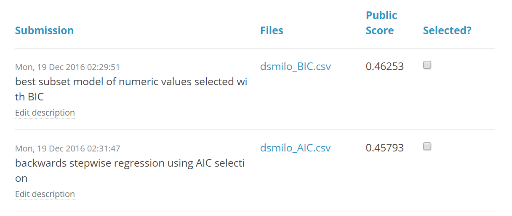

```{r setup, include=FALSE}
library(knitr)
library(pander)
opts_chunk$set(echo=FALSE, warning=FALSE, message=FALSE, comment=NA, fig.align='center')
```

## Background
The Kaggle [House Prices: Advanced Regression Techniques](https://www.kaggle.com/c/house-prices-advanced-regression-techniques) competition provides a dataset containing final sale prices and 79 explanatory variables describing aspects of residential homes in Ames, Iowa.  This dataset is utilized to apply the learnings and techniques taught in the Fundamentals of Computational Math class.

```{r load-data}
# read in training data, use ID column as row names
train <- read.csv('data/train.csv', row.names = 1)
```

For deeper investigation, the final sale price (in dollars) is defined as the dependent variable $Y$ and the above grade living area (in square feet) is defined as the independent variable $X$.  Both of these variables are skewed to the right, as illustrated in the [Statistics](#scat-hist) section below.

```{r set-vars}
# set Y variable and select X variable
Y <- train$SalePrice
X <- train$GrLivArea
```


## Probability
After setting the values $x$ and $y$ are set to the 3rd quartile of $X$ and 2nd quartile of $Y$, respectively, the below probabilities are investigated.

```{r set-conditions}
# set x & y
x <- quantile(X)[['75%']]
y <- quantile(Y)[['50%']]
```

$$\begin{align}
P(X>x | Y>y) &= \frac{P(X > x \ \cap \ Y > y)}{P(Y > y)} \\
             &= \frac{\frac{`r sum(X > x & Y > y)`}{`r nrow(train)`}}
                     {\frac{`r sum(Y > y)`}{`r nrow(train)`}}
              = `r round(sum(X > x & Y > y) / sum(Y > y), 4)`
\end{align}$$

Given that a house's sale price is above the median price, there is a `r round(100 * sum(X > x & Y > y) / sum(Y > y), 2)`% chance that its living area is above the 75th percentile.

$$\begin{align}
P(X>x, Y>y) &= P(X > x \ \cap \ Y > y) \\
            &= \frac{`r sum(X > x & Y > y)`}{`r nrow(train)`} 
             = `r round(sum(X > x & Y > y) / nrow(train), 4)`
\end{align}$$

Among all houses, there is a `r round(100 * sum(X > x & Y > y) / nrow(train), 2)`% chance that the living area is above the 75th percentile and the sale price is above the median.

$$\begin{align}
P(X<x | Y>y) &= \frac{P(X < x \ \cap \ Y > y)}{P(Y > y)} \\
             &= \frac{\frac{`r sum(X < x & Y > y)`}{`r nrow(train)`}}
                     {\frac{`r sum(Y > y)`}{`r nrow(train)`}}
              = `r round(sum(X < x & Y > y) / sum(Y > y), 4)`
\end{align}$$

Given that a house's sale price is above the median price, there is a `r round(100 * sum(X < x & Y > y) / sum(Y > y), 2)`% chance that its living area is below the 75th percentile.

```{r cnt-tbl}
# get table of counts
cnt_tbl <- matrix(nrow = 3, byrow = TRUE,
  data = c(sum(X <= x & Y <= y), sum(X <= x & Y > y), sum(X <= x),
           sum(X > x & Y <= y), sum(X > x & Y > y), sum(X > x),
           sum(Y <= y), sum(Y > y), nrow(train)))
colnames(cnt_tbl)  <- c('Y <= y', 'Y > y', 'Total')
row.names(cnt_tbl) <- c('X <= x', 'X > x', 'Total')
pander(cnt_tbl)
```

### Independence
Splitting the variables by quantile such that $A$ is the subset of $X$ where $X > x$ and $B$ is the subet of $Y$ where $Y > y$, these variables can be tested for independence.

The value of $P(A|B)$ is equivalent to $P(X>x | Y>y)$, which was shown above to be `r round(sum(X > x & Y > y) / sum(Y > y), 4)`.  To test for independence, this is compared to the product of the probabilities of $A$ and $B$:
$$\begin{align}
P(A) \times P(B) &= P(X>x) \times P(Y>y) \\
&= \frac{`r sum(X > x)`}{`r length(X)`} \times \frac{`r sum(Y > y)`}{`r length(Y)`} 
= `r round(sum(X > x) / length(X) * sum(Y > y) / length(Y), 4)`
\end{align}$$

Since $P(A|B) \neq P(A)P(B)$, the variables $A$ and $B$ are not independent.

This can be verified further using the `chisq.test` function to run a $\chi^2$ test for the variables $X$ and $Y$.

```{r chisq}
chisq <- chisq.test(data.frame(X, Y))
```

The p-value of this $\chi^2$ test with 1459 degrees of freedom is essentially zero, so the null hypothesis that the variables are independent is rejected.


## Descriptive and Inferential Statistics

Summary statistics for $X$ and $Y$ are provided in the table below:
```{r summary}
# prepare summary table supplemented with standard deviation
sum_tbl <- rbind(c(summary(X), 'Std. Dev.'=round(sd(X), 0)),
                 c(summary(Y), 'Std. Dev.'=round(sd(Y), 0)))
row.names(sum_tbl) <- c('X', 'Y')
pander(sum_tbl)
```

The plots below show the univariate and joint distributions of the two variables
<a name="scat-hist"/> <!-- set ref for linking above-->
```{r scat-hist, fig.height=6, fig.width=6}
library(ggplot2)
library(scales)
# scatter of X & Y
pscat <- ggplot(data.frame(X, Y), aes(X, Y / 1000)) + 
  geom_point(alpha = 0.25) +
  scale_x_continuous('Above Grade Living Area [square feet]') + 
  scale_y_continuous('Sale Price [thousands]', labels = dollar)
# histogram of X
px <- ggplot(data.frame(X), aes(X, ..count.. / sum(..count..))) + 
  geom_histogram(alpha = 0.5, col = 'black', binwidth = 200) +
  scale_x_continuous(name = NULL, labels = NULL) +
  scale_y_continuous(name = '', labels = percent)
# histogram of Y
py <- ggplot(data.frame(Y), aes(Y, ..count.. / sum(..count..))) + 
  geom_histogram(alpha = 0.5, col = 'black', binwidth = 25000) + 
  scale_x_continuous(name = NULL, labels = NULL) + 
  scale_y_continuous(name = '', labels = percent) +
  coord_flip()

# combined plots
library(grid)
library(gridExtra)
grid.arrange(px, rectGrob(NA), pscat, py,
             nrow=2, widths = c(0.8, 0.2), heights = c(0.2, 0.8),
             top = 'Histograms and Scatterplot of X & Y Variables')
```
</a>

```{r diffmean}
diffmean <- t.test(X, Y, paired = TRUE)$conf.int
```


Using the `t.test` function, a 95% confidence interval for the difference in the means of $X$ and $Y$ is given by 
[`r format(diffmean[1], scientific = FALSE, big.mark = ',')`, 
 `r format(diffmean[2], scientific = FALSE, big.mark = ',')`].
The p-value associated with this hypothesis test is essentially zero, so the null hypothesis that there is no difference between the means is rejected at any significance level.

A corrleation matrix for the two variables is presented below:

```{r cormat}
cormat <- cor(data.frame(X, Y))
pander(cormat)
```

```{r cortest}
cortest <- cor.test(X, Y, conf.level = 0.99)
```


To test the hypothesis that there is no correlation between $X$ and $Y$, the `cor.test` function is used.  Using this function, a 99% confidence interval for the correlation between the variables is given by [`r cortest$conf.int[1]`, `r cortest$conf.int[2]`].  The p-value associated with this hypothesis test is near-zero, so the null hypothesis that there is no correlation between the variables is rejected.

This means that it can be said with greater than 99.99% confidence that living area and sale price of homes are correlated, and it can be said with 99% confidence that the value of this correlation lies between `r round(cortest$conf.int[1], 4)` and `r round(cortest$conf.int[2], 4)`.


## Linear Algebra and Correlation
As shown above, the correlation matrix is given by
$$C = \left[ \begin{array}{cc}
`r cormat[1,1]` & `r cormat[1,2]` \\`r cormat[2,1]` & `r cormat[2,2]`
\end{array} \right]$$

To get the precision matrix, this matrix is inverted using the `solve` function:
```{r get-prec}
precmat <- solve(cormat)
```

This gives a precision matrix of
$$P = C^{-1} = \left[ \begin{array}{cc}
`r precmat[1,1]` & `r precmat[1,2]` \\`r precmat[2,1]` & `r precmat[2,2]`
\end{array} \right]$$

Multiplying the correlation and matrices together, in either order, gives the identity matrix:
$$C P = 
\left[ \begin{array}{cc}1 & 0 \\0 & 1\end{array} \right]
= P C$$

### Principal Components Analysis
In order to conduct principal components analysis, numeric explanatory values are considered.  The `LotFrontage` variable contains a number of missing variables, but no values of zero -- these are imputed with 0, as these properties may not have any street frontage (such as condominiums).  A simlar approach is taken for the `MasVnrArea` variable.

The `GarageYrBlt` variable also has a number of missing values -- these, similarly, likely represent homes with no garages.  These values are filled based on the `YearBuilt` variable and the median difference between `YearBuilt` and `GarageYrBlt` (which happens to be zero).

```{r pca-prep}
# first variable is categorical values stored by numeric key; convert to factor
train$MSSubClass <- factor(train$MSSubClass)
# impute LotFrontage and MasVnrArea with zero
train$LotFrontage[is.na(train$LotFrontage)] <- 0
train$MasVnrArea[is.na(train$MasVnrArea)] <- 0
# impute GarageYrBlt with delta between YearBuilt
train$GarageYrBlt[is.na(train$GarageYrBlt)] <- 
  train$YearBuilt[is.na(train$GarageYrBlt)] +
  median(train$GarageYrBlt - train$YearBuilt, na.rm = TRUE)
# gather all explanatory variables and exclude non-numeric variables
library(dplyr)
pca_data <- train[, sapply(train, is.numeric)] %>% select(-SalePrice)
```

```{r get-pca}
# perform PCA
pca_results <- prcomp(pca_data, center = TRUE, scale. = TRUE)
# gather importance of PCA into data frame
importance_tbl <- summary(pca_results)$importance
importance_tbl <- data.frame(t(importance_tbl), check.names = FALSE)
importance_tbl$`Principal Component` <- 1:nrow(importance_tbl)
# plot individual and cumulative variance explained
ggplot(importance_tbl, aes(x = `Principal Component`)) + 
  geom_bar(aes(y = `Proportion of Variance`), stat = 'identity', show.legend = TRUE) + 
  geom_line(aes(y = `Cumulative Proportion`)) + 
  geom_hline(yintercept = 0.95, lty = 2, col = 'red') + 
  geom_vline(xintercept = 25, lty = 3, col = 'darkgreen') +
  scale_y_continuous(labels = percent) +
  labs(title = 'Variance Captured by Principal Components Analysis',
       subtitle = 'Bars: Individual Proportion; Line: Cumulative Proportion')
```

As shown in the chart above, the first principal component explains roughly 20% of the total variance.  The first seven components explain 50% of the variance, with 95% of the variance explained by the first 25 components.


## Calculus-Based Probability & Statistics
```{r exp-fit}
# fit X to exponential distribution and extract parameter
expfit <- MASS::fitdistr(X, 'exponential')
lambda <- expfit$estimate[[1]]
```

Using the `fitdistr` function from the `MASS` package, an exponential distribution is fit to the living area variable $X$.  No transformation of the variable is needed, as all values of $X$ are positive.  This fitting results in an optimal parameter of 
$\lambda = `r round(lambda, 7)`$

1000 samples from an exponential distribution with $\lambda = `r round(lambda, 7)`$ are simulated using the `rexp` function.  This simulation produces the following distribution, which is contrasted to the distribution of the observed $X$ data:
```{r exp-sample}
# simulate sample with set.seed for replicability
set.seed(421)
sim <- rexp(1000, lambda)

# histogram of simulated results
psim <- ggplot(data.frame(sim), aes(sim, ..count.. / sum(..count..))) + 
  geom_histogram(alpha = 0.5, col = 'black', binwidth = 200) +
  scale_x_continuous(name = '', limits = c(0, 6000)) +
  scale_y_continuous(name = '', labels = percent) +
  ggtitle('Simulated Data')

# histogram of X from above with some tweaking
px <- px + scale_x_continuous(name = '', limits = c(0, 6000)) + 
  ggtitle('Observed Data')

# show plots together
grid.arrange(psim, px, ncol=1)
```

The difference in these distributions is apparent -- the simulated data have the highest frequency close to zero, while the observed data seem to show a roughly normal (albeit strongly right-skewed) distribution centered around 1500.  These differences are further highlighted by the differences in the percentiles of the distribution and the data -- the 5th and 95th percentiles are presented in the table below.

```{r percentiles}
# create table of percentiles using qexp and quantile
perc_tbl <- matrix(c(round(qexp(0.05, lambda), 2), round(qexp(0.95, lambda), 2),
                     round(quantile(X, 0.05), 2), round(quantile(X, 0.95), 2)),
                   nrow = 2, byrow = TRUE)

colnames(perc_tbl)  <- c('5%', '95%')
row.names(perc_tbl) <- c('Simulated', 'Observed')
pander(perc_tbl)
```

```{r confint}
# get standard error of sample
se <- sd(X) / sqrt(nrow(train))
# use standard error to get CI
ci <- c(mean(X) - qnorm(0.975) * se, mean(X) + qnorm(0.975) * se)
```

Since the observed $X$ data appears roughly normal, the mean $\bar{X} = `r round(mean(X), 1)`$, standard deviation $s_X = `r round(sd(X), 1)`$ and size $n = `r nrow(train)`$ of the sample are used to generate a 95% confidence interval for the mean of all homes, given by 
$[`r round(ci[1], 2)`, `r round(ci[2], 2)`]$.


## Modeling
In order to predict the sale price of houses using information about the characteristics of a house, two regression models are constructed and their results entered into the Kaggle competition.
  
### Best Subsets and BIC
The first model considers only the numeric variables examined in previous section.  The `leaps` package is utilized to determine the minimum Bayesian Information Criterion (BIC) to select the best model -- this occurs with 15 predictors, as shown below.

```{r BIC-model-prep, echo=TRUE}
# use numeric variables from PCA; include target variable
model_data <- cbind(pca_data, SalePrice = train$SalePrice)
# use regsubsets to get best subsets per number of variables
library(leaps)
regfit <- regsubsets(SalePrice~., data = model_data, nvmax = 20)
```

```{r BIC-model-graph, fig.width=9}
reg.summary <- summary(regfit)
# plot variables vs BIC & BIC vs # variables
par(mfrow = c(1, 2), mar=c(1,1,1,1))
plot(regfit, scale = "bic", main = "Predictor Variables vs. BIC")
plot(reg.summary$bic, xlab = "Number of Predictors", ylab = "BIC", 
     type = "l", main = "Best Subset Selection Using BIC")
# annotate lowest BIC
minbic <- which.min(reg.summary$bic)
points(minbic, reg.summary$bic[minbic], col = "brown", cex = 2, pch = 20)
```

The parameters of this model are presented below:
```{r BIC-model-run}
# get formula using 15 criteria
usedvars = names(coef(regfit, minbic))[-1]
BIC_model = paste0("glm(SalePrice ~ ", paste(usedvars, collapse = " + "), 
                   ", data = model_data)")
# run model and print summary
bestsubset = eval(parse(text = BIC_model))
# print model summary
pander(summary(bestsubset))
```


### Stepwise Regression and AIC
The second model considers all variables without missing values.  Beginning with a full regression of these variables, a backwards stepwise regression is run, with the optimal model selected based on the Akaike Information Criterion (AIC) to select the best model.  Since this model includes categorical values and associated dummy values, the number of predictors is far higher -- the final model includes 132 variables.

The parameters of this model are presented below:
```{r stepwise-model, echo=TRUE}
# select variables with no NA values
nona <- train[, which(sapply(train, function(x) sum(is.na(x))) == 0)]
# prepare stepwise model using all non-NA variables
stepback <- step(lm(SalePrice ~ ., nona), direction = 'backward', trace = FALSE)
```

`r pander(summary(stepback))`

### Prediction

Both models are used to predict the sale price of homes in the test data set provided in the competition.  This data set is read in, and the same imputation applied to the training data set is applied to it prior to prediction.

```{r test-data}
# read in test data, using ID column as row names
test <- read.csv('data/test.csv', row.names = 1)

# apply same imputations to test data as train data
test$MSSubClass <- factor(test$MSSubClass)
test$LotFrontage[is.na(test$LotFrontage)] <- 0
test$MasVnrArea[is.na(test$MasVnrArea)] <- 0
test$GarageYrBlt[is.na(test$GarageYrBlt)] <- 
  test$YearBuilt[is.na(test$GarageYrBlt)] +
  median(test$GarageYrBlt - test$YearBuilt, na.rm = TRUE)
```


Predictions of `NA` are imputed with the median of the sale price in the training data set.  The predictions generated each contain some negative numbers; as a result, all values are shifted so that the minimum value predicted is zero.

```{r predict}
# apply models to test dataset
pred_bic = predict(bestsubset, test)
pred_aic = predict(stepback, test)

# impute median for NAs
pred_bic[is.na(pred_bic)] <- median(train$SalePrice)
pred_aic[is.na(pred_aic)] <- median(train$SalePrice)

# shift values so all are positive
pred_bic <- pred_bic - min(pred_bic)
pred_aic <- pred_aic - min(pred_aic)

# store as data frames
pred_bic <- data.frame(Id = names(pred_bic), SalePrice = pred_bic)
pred_aic <- data.frame(Id = names(pred_aic), SalePrice = pred_aic)
```

The distribution of predictions from the two models, as well as a scatterplot showing the relationship between predictions by both models, are presented below:

```{r pred-plots, fig.width=8}
# collect both predictions from both models by Id
preds <- inner_join(pred_bic, pred_aic, by = 'Id')
names(preds) <- c('Id', 'BIC', 'AIC')

# scatter of model predictions
ppredscat <- ggplot(preds, aes(BIC, AIC)) + geom_point(alpha = 0.5)

# tidy predictions for faceting
library(tidyr)
preds <- preds %>% gather(model, SalePrice, -Id)

# histograms faceted by model
ppredhist <- ggplot(preds, aes(x = SalePrice, fill = model)) + 
  geom_histogram(binwidth = 25000, alpha = 0.5, position = 'identity',
                 col = 'black', show.legend = FALSE) +
  facet_wrap(~model, ncol = 1, as.table = FALSE)

# show all plots
grid.arrange(ppredscat, ppredhist, nrow = 1)
```

#### Results
The results of the two models' predictions are output to csv files and submitted to the Kaggle competition under the username [dsmilo](https://www.kaggle.com/dsmilo).  The scores of these results are posted below:
```{r write-results}
# store results
write.csv(pred_bic, 'dsmilo_BIC.csv', row.names = FALSE)
write.csv(pred_aic, 'dsmilo_AIC.csv', row.names = FALSE)
# show results

```

